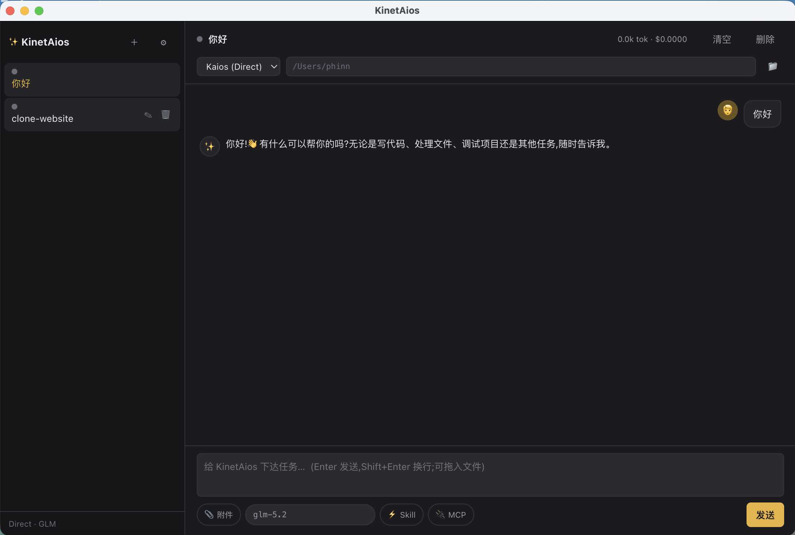

# KinetAios

[](LICENSE)
[](https://github.com/phinn/KinetAios)
[](https://github.com/phinn/KinetAios/releases/latest)
[](#install)

> 🌐 **[官网 / Website → https://phinn.github.io/KinetAios/](https://phinn.github.io/KinetAios/)**

> 🚀 **We're live on Product Hunt today** — [upvote & say hi](https://www.producthunt.com/products/kinet-aios)

<!-- TODO: drop a 1440×900 screenshot or 30s GIF at docs/hero.png, then remove this note -->


**A local-first, multi-engine AI agent dashboard.** Run Claude Code, Codex, and a built-in ReAct loop side-by-side from one window. Local SQLite history + long-term memory that extracts durable facts automatically. **No account, no relay server — your LLM API key is the only auth.**

English | [简体中文](README.zh-CN.md)

---

## Why KinetAios?

Most AI clients lock you into one provider, lose context when you switch engines, and route your conversations through a relay server. KinetAios runs **three engines from one window**, with cross-engine long-term memory and **no account**.

|  | KinetAios | Claude Desktop | Cherry Studio | Cursor | Codex Desktop |
|---|---|---|---|---|---|
| Three-engine switch (Direct / Claude Code / Codex) | ✅ | — | — | — | — |
| Local SQLite + automatic long-term memory | ✅ | — | — | — | — |
| Cross-engine memory (one user profile, all engines) | ✅ | — | — | — | — |
| Multiple parallel sessions | ✅ | — | ✅ | — | ✅ |
| Global hotkey + quick panel | ✅ | — | — | — | — |
| Auto-scan MCP / Skills / Agents | ✅ | ✅ | — | — | — |
| Project rules (AGENTS / CLAUDE / KINET) | ✅ | — | — | ✅ | ✅ |
| Local-first, no account | ✅ | ✅ | ✅ | — | — |

## Install

Download the latest release:

- **Windows** — [`KinetAios-Setup-1.0.0.exe`](https://github.com/phinn/KinetAios/releases/latest) (NSIS installer)
- **macOS** — see [releases](https://github.com/phinn/KinetAios/releases/latest)

> Unsigned build → Windows SmartScreen / macOS Gatekeeper will warn; allow manually.

**First launch**: click ⚙ top-right → fill in **API Key** (+ Base URL / model; default GLM Zhipu) → once "Test connection" passes, send a task.

### Run from source

Requires **Node.js 18+** and internet (the `better-sqlite3` native module needs to compile).

```sh
cd KinetAiosWin
npm install      # postinstall rebuilds better-sqlite3 for Electron
npm run build
npm start
```

> On a CN network `npm install` may time out fetching the Electron binary — `.npmrc` is already configured with the npmmirror mirror; on failure you can also run `ELECTRON_MIRROR=https://npmmirror.com/mirrors/electron/ node node_modules/electron/install.js`.

---

## Tech stack

- **Electron + TypeScript** — the main process runs the agent runtime; the renderer is a native web UI.
- **better-sqlite3** — SQLite + FTS5 (history / `recall_memory` full-text search).
- **No frontend framework** — the renderer is vanilla TS + HTML/CSS, bundled with esbuild.

## Features

### Three engines (switchable per session; switching clears cross-engine context)
- **Direct (Kaios)** — a built-in ReAct loop with a GLM/OpenAI-compatible & Anthropic **bidirectional SSE streaming** provider, tool-level concurrency, sub-agents, context compaction, and retry.
- **Claude Code** — spawns `claude -p --output-format stream-json`, parses NDJSON, resumes with `--resume`.
- **Codex** — spawns `codex exec --json`, parses JSONL, resumes past sessions.

### Direct tools (10)
`shell` (asks for confirmation before running), `read_file`, `write_file`, `edit_file` (precise replace), `grep` (recursive content search), `glob` (list files), `web_fetch`, `recall_memory`, `git_diff` (read-only, no confirmation; args: `file`, `ref`, `cached`), and `dispatch_agent` (a read-only sub-agent — reuses the ReAct loop with its own context). Claude/Codex use their own CLI tool systems.

### MCP
The Direct engine auto-connects to MCP services configured on the system (scans `~/.claude.json` / `~/.codex/config.toml` / Claude Desktop) over a stdio client; tools are merged into the ReAct loop; dropped connections auto-reconnect. The 🔌 button lists connected services/tools.

### Skills / Commands / Agents
Scans Claude Code skills + commands + agents (including installed plugin content) and Codex skills; invoke via the `/` menu or the ⚡ button; the body is injected into Direct.

### Sidebar actions (left to right)
- **＋** — new session.
- **📂 Workbench** — project cards grouped by cwd. Each card shows recent activity + cost; click to switch. The **Context** button edits that project's `KINET-CONTEXT.md` (extra context injected when the agent runs in that cwd).
- **📊 Dashboard** — standalone window: live token usage, cost stats, engine distribution across all sessions.
- **🌐 Files** — standalone Files window. Left: cwd file tree (lazy-expanded, click to open). Right: `<webview>` preview for HTML/SVG/PNG/JPG/PDF/CSS, or textarea editor for everything else (`Ctrl/Cmd+S` saves). Address bar accepts `file://`, `http(s)://`, and `localhost:<port>`.
- **🧠 Memory** — long-term memory panel. Toggle **Current channel / All** to scope. Each row shows the fact + source channel; inline **edit** + **delete** per row.
- **⚙️ Settings** — see below.

### Main window tabs (chat / files / git / rules)
- **Chat** — conversation with streaming, tool-step folds, left/right bubbles, live token counter.
- **Files** — same engine as the 🌐 window, mounted inline on first click; follows the current session's cwd.
- **Git** — `git status` (left) + `git log` (right). Click a changed file → side-by-side diff. Click a commit → unified `git show` (metadata and diff body styled separately).
- **Rules** — edits cwd's `KINET.md` (project-level rules injected into the system prompt).

### Settings (⚙️)
Five sections:
- **API** — provider, base URL, model, key. Presets for GLM / DeepSeek / OpenAI / Anthropic; **Test** before saving.
- **Behavior** — shell approval mode, sandbox level, engine enable flags.
- **Pricing** — input/output prices per model for cost calculation.
- **Interface** — language (English / 简体中文 / 繁體中文 / 日本語), **theme (dark / light, live preview)**.
- **Long-term memory** — **Export to JSON** (backup or migrate; structured `{version, exportedAt, memories[]}`), **Import from JSON** (accepts structured or plain array, dedupes by content, reports `imported/skipped`).

### Other
- **Per-session model** (editable dropdown; OpenAI-compatible + Anthropic dual protocol).
- **File attachments** — 📎 pick / drop multiple text files (large files read only the head); `@path` references files in cwd.
- **AGENTS.md / CLAUDE.md / KINET.md** — rule files in cwd are auto-injected into the system prompt.
- **Long-term memory** — each turn extracts durable facts about the user in the background, stored in SQLite, injected into the next turn's system prompt. Cross-engine (Direct / Claude Code / Codex) and cross-session by design.
- **Tray + global hotkey** — `Ctrl/Cmd+Alt+Space` summons the quick panel (closing the window quits; the hotkey is active while the app runs).
- **Configurable brand** (`brand.json`), **encrypted API key storage** (safeStorage: macOS Keychain / Windows DPAPI).

## Directory layout

```
KinetAiosWin/
  brand.json               # brand config (product name etc., read at startup)
  package.json
  src/
    shared/types.ts         # types + applyEvent (shared by main/renderer, single source of truth)
    shared/i18n.ts          # four-language string table + t()
    main/
      main.ts               # windows / tray / hotkey / IPC / shell-confirm bridge
      TaskManager.ts        # session management + engine dispatch + memory extraction
      engines.ts            # Engine interface + Direct/ClaudeCode/Codex + cross-platform CLI spawn
      AgentLoop.ts          # ReAct loop (Direct) + history compaction + reactive trim
      glm.ts                # Provider + OpenAI/Anthropic SSE streaming + retry
      tools.ts              # 10 tools + cross-platform shell (cmd.exe / sh) + dispatch_agent
      mcp.ts                # MCP client (scan + stdio + reconnect)
      skills.ts             # skills/commands/agents/plugin scan
      brand.ts              # brand config reader
      store.ts              # better-sqlite3 + FTS5
      settings.ts           # config (encrypted API key persistence, lang)
    preload/preload.ts      # the narrow API exposed via contextBridge
    renderer/
      index.html quick.html styles.css
      app.ts                # dashboard logic
      quick.ts              # quick panel logic
      markdown.ts           # mini markdown renderer
```

## Build / dev

```sh
npm run build       # tsc (main) + esbuild (renderer) + copy brand.json
npm run typecheck   # typecheck both halves (no output)
npm start           # launch (requires a prior build)
npm run dev         # build + start
```

## Package

```sh
npm run dist         # current platform's default target
```

- **Windows** — `release\KinetAios Setup <ver>.exe` (NSIS). **Must be built on Windows** (cross-building Windows + native modules from macOS is unreliable).
- **macOS** — build a dmg: `npx electron-builder --mac` (needs a mac toolchain).
- electron-builder rebuilds `better-sqlite3` against Electron's ABI; `asar: false` avoids native-module load errors from inside an asar.
- **Unsigned** → Windows SmartScreen / macOS Gatekeeper will warn; users allow manually. Removing the warning needs a signing cert + Apple notarization.
- The default icon is Electron's; to use your own: Windows `build/icon.ico` (256×256), mac `build/icon.icns`.

## Known constraints

- **Closing the window quits** (no background persistence); the global hotkey only works while the app runs. If you want "close-to-tray + always-on hotkey", switch back to hide-on-close.
- Codebase indexing / semantic retrieval, image multimodality, IDE plugins, etc. are on the `IMPROVEMENTS.md` roadmap (not done).
- Mac→Windows cross-build of the native module is unreliable — build Windows installers on a Windows machine or via `windows-latest` GitHub Actions.
