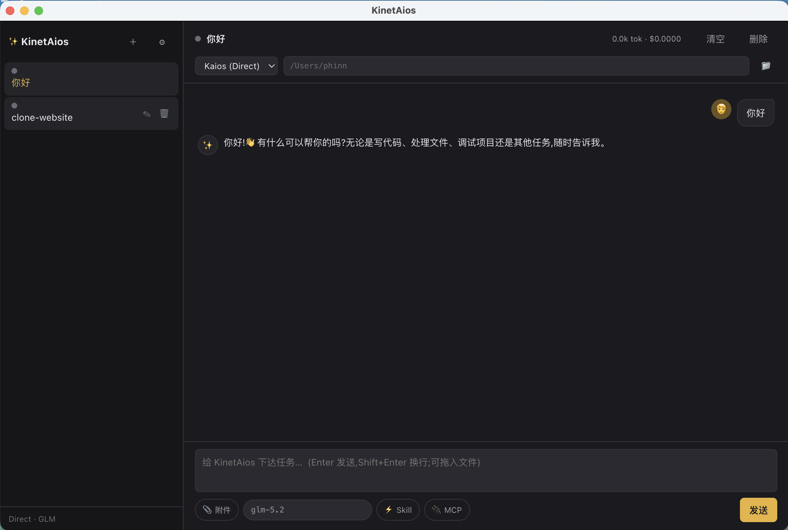
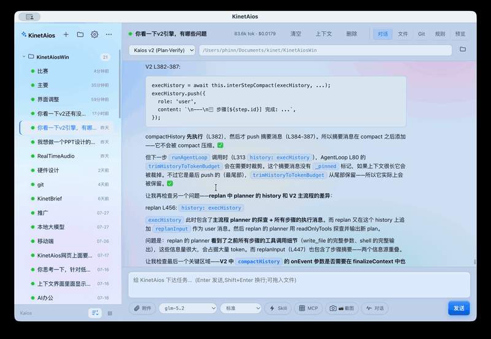

# KinetAios

<!-- SEO: keywords for GitHub/NPM search discoverability -->
<!--
AI agent dashboard | local-first AI | multi-engine agent | Claude Code GUI | Codex GUI |
ReAct agent | AI coding assistant | MCP client | Electron AI | TypeScript AI agent |
Ollama desktop | AMD Radeon AI | offline AI agent | open source AI agent |
AI 工作台 | 本地 AI Agent | 多引擎 AI | 开源 AI 编程助手
-->

[](LICENSE)
[](https://github.com/phinn/KinetAios)
[](https://github.com/phinn/KinetAios/releases/latest)
[](#install)

> 🌐 **[官网 / Website → https://phinn.github.io/KinetAios/](https://phinn.github.io/KinetAios/)**





> 📊 **[查看完整四引擎对比报告 →](documents/excel-cross-analysis-engines.html)** — Direct V1 / Direct V2 / Direct V3 (DAG parallel) / Claude Code / Codex / DeepSeek Harness 在真实数据分析场景下的全维度评估。

**A local-first, multi-engine AI agent dashboard.** Run **Direct (V1 ReAct / V2 / V3 DAG-parallel), Claude Code, Codex, and DeepSeek Harness** side-by-side from one window. Local SQLite history + long-term memory that extracts durable facts automatically. **No account, no relay server — your LLM API key is the only auth.**

English | [简体中文](README.zh-CN.md)

---

## Why KinetAios?

Most AI clients lock you into one provider, lose context when you switch engines, and route your conversations through a relay server. KinetAios runs **four engines from one window**, with cross-engine long-term memory and **no account**.

|  | KinetAios | Claude Desktop | Cherry Studio | Cursor | Codex Desktop |
|---|---|---|---|---|---|
| Four-engine switch (Direct V1/V2/V3 + Claude Code + Codex + DeepSeek Harness) | ✅ | — | — | — | — |
| Messaging channels (Feishu + WeCom bot) | ✅ | — | — | — | — |
| Local SQLite + automatic long-term memory | ✅ | — | — | — | — |
| Cross-engine memory (one user profile, all engines) | ✅ | — | — | — | — |
| Multiple parallel sessions | ✅ | — | ✅ | — | ✅ |
| Global hotkey + quick panel | ✅ | — | — | — | — |
| Auto-scan MCP / Skills / Agents | ✅ | ✅ | — | — | — |
| Project rules (AGENTS / CLAUDE / KINET) | ✅ | — | — | ✅ | ✅ |
| Built-in MCP Server (remote agent control) | ✅ | — | — | — | — |
| Plugin system (tools / panels / slash commands) | ✅ | — | — | — | — |
| Multimodal (image input + voice + screenshot) | ✅ | ✅ | — | — | — |
| Text-to-video generation (MiniMax H3) | ✅ | — | — | — | — |
| Session branching + cross-engine pipeline | ✅ | — | — | — | — |
| Local-first, no account | ✅ | ✅ | ✅ | — | — |

## Install

Download the latest release:

- **Windows** — [`KinetAios-Setup-3.3.0.exe`](https://github.com/phinn/KinetAios/releases/latest) (NSIS installer)
- **macOS** — see [releases](https://github.com/phinn/KinetAios/releases/latest)

> Unsigned build → Windows SmartScreen / macOS Gatekeeper will warn; allow manually.

> ⚠️ **v2.9.0 userData directory migration** — Starting from v2.9.0, the Windows `userData` directory changed from `%APPDATA%/kinetaios-win` to `%APPDATA%/KinetAios`. New installs automatically use the new path. **If you downgrade to a pre-2.9.0 build**, it will look for the old directory and appear empty (no conversations, no settings). To fix: rename `%APPDATA%/KinetAios` back to `%APPDATA%/kinetaios-win`.
>
> **v2.9.0+ 不建议退回旧版本。** 如需回退，手动将 `%APPDATA%/KinetAios` 重命名为 `%APPDATA%/kinetaios-win` 即可恢复旧版数据。

**First launch**: click ⚙ top-right → fill in **API Key** (+ Base URL / model; default GLM Zhipu) → once "Test connection" passes, send a task.

## Kinet Suite

KinetAios is part of the [Kinet product family](https://phinn.github.io/kinetapp/index.html):

- **KinetFit** — smart health & fitness companion
- **KinetAgent** — AI automation assistant
- **KinetBrief** — intelligent briefing & note app

## Run from source

Requires **Node.js 18+** and internet (the `better-sqlite3` native module needs to compile).

```sh
cd KinetAiosWin
npm install      # postinstall rebuilds better-sqlite3 for Electron
npm run build
npm start
```

> On a CN network `npm install` may time out fetching the Electron binary — `.npmrc` is already configured with the npmmirror mirror; on failure you can also run `ELECTRON_MIRROR=https://npmmirror.com/mirrors/electron/ node node_modules/electron/install.js`.

---

## Features

### Four engines (switchable per session; switching clears cross-engine context)
- **Direct V1 (Kaios)**: built-in ReAct loop + GLM/OpenAI-compatible & Anthropic **dual-protocol SSE streaming** provider, with tool-level concurrency, sub-agent dispatch, context compaction, and retry.
- **Direct V2**: next-gen ReAct with Plan-Execute-Verify-Judge architecture, streaming tool calls, and enhanced reasoning. Shared tool set with V1.
- **Direct V3**: latest, with **intent router** that picks `fast` / `standard` / `deep` paths per query, and the `deep` path executes tool calls as a **DAG with parallel branches** for real speedups on multi-step tasks.
- **Claude Code**: spawns `claude -p --output-format stream-json`, parses NDJSON, resumes via `--resume`.
- **Codex**: spawns `codex exec --json`, parses JSONL, `resume` continuation.
- **DeepSeek Harness** *(3.0+)*: spawns the `dsh` CLI, OpenAI-compatible SSE, OpenAI / Pi-AI provider adapters with retry and token metering. Switchable per session like the others.

### Direct tools (20+)
`shell` (confirm before exec), `read_file`, `write_file`, `edit_file` (precise replacement), `grep` (recursive content search), `glob` (list files), `web_fetch` (SSRF-protected, Jina Reader fallback), `web_search` (Bing → DuckDuckGo), `recall_memory`, `git_diff` (read-only), `remember_fact` / `recall_fact` (session anchors), `memory_replace` / `memory_append` (core memory blocks), `dispatch_agent` (read-only sub-agent with independent context), `spawn_team` / `team_broadcast` / `team_send` / `team_close` (multi-agent teams), `video_gen` (MiniMax H3 text-to-video), `feishu_send_file` (send files to Feishu chat). Plugin-injected tools may add more.

### MCP integration (client + server)
- **Client**: auto-discovers system-configured MCP services (`~/.claude.json`, `~/.codex/config.toml`, Claude Desktop config), stdio transport, auto-reconnect. 🔌 button shows connected services/tools.
- **Server**: built-in MCP Server (HTTP+SSE) exposes `run_agent` — remote machines can invoke your local agent with full tool access. Token-authenticated (timing-safe comparison), 5-min timeout, zombie-connection detection.

### Long-term memory + memory graph
- Auto-extracts durable facts from each turn → SQLite → injected into next turn. **Cross-engine, cross-session.**
- **Memory graph** visualization: force-directed graph showing memory provenance, conflict detection, and timeline. Separate full-screen window.
- Import/export memories as JSON (migration / backup).

### Skills / Commands / Agents / Plugins
- Scans Claude Code's skills + commands + agents and Codex's skills. `/` menu or ⚡ button.
- **Plugin SDK v3**: plugins can contribute tools, slash commands, hooks, and full-screen panels. Per-need injection (keyword matching saves ~60% tokens). Built-in plugins: office-suite, brainstorm (Excalidraw), math-practice, cpp-learning, low-altitude, and more.

### Sidebar (left → right)
- **＋** New session.
- **📂 Workbench** — project cards grouped by cwd, showing recent activity + cost. "Context" button edits `KINET-CONTEXT.md`.
- **📊 Dashboard** — independent window: real-time token usage, cost stats, engine distribution (all sessions aggregated).
- **🌐 Files** — file browser + `<webview>` preview (HTML/SVG/PNG/JPG/PDF) + textarea editor. Multi-tab support. Address bar accepts `file://` / `http(s)://` / `localhost:<port>`.
- **🏘️ Town** — game-style isometric visualization of remote nodes (other KinetAios instances on your network).
- **🧠 Memory** — memory panel: current channel / all scope, inline edit/delete, provenance.
- **🔌 Plugins** — plugin management: enable/disable, search, category cards.
- **⚙️ Settings** — see below.

### Main window tabs (Chat / Files / Git / Rules)
- **Chat** — streaming output, collapsible tool steps, real-time token count, context inspector, screenshot, voice input.
- **Files** — same as 🌐 sidebar, follows current session cwd.
- **Git** — `git status` (left) + `git log` (right). Click file → side-by-side diff; click commit → formatted `git show`.
- **Rules** — edit cwd's `KinetAios.md` (project-level rules, injected into system prompt).

### Pipeline (cross-engine orchestration)
Chain multiple stages, each specifying an engine + prompt. Previous stage's output auto-prepends to next stage's prompt. 2-min per-stage timeout with polling, fail-fast abort.

### Session branching & handoff
- **Branch**: fork from any turn — deep-copies turns/steps into a new session.
- **Export/import session**: serialize full session state (turns + history + engine + model + cwd) for cross-machine handoff. Sensitive data (API keys, secrets) auto-redacted on export.
- **Cross-session references**: link related sessions, visualized as a DAG task graph.

### Context management (Direct engine)
- **Context inspector**: view/edit the raw `directHistory` array per session (JSON textarea editor).
- **Auto-compaction**: when history exceeds token budget, early turns are summarized by the LLM. Compaction events visualized in the UI (before/after token counts).
- **Per-protocol token calibration**: token/char ratio tracked separately per API protocol (OpenAI vs Anthropic), preventing concurrent sessions from skewing each other's estimates.

### Multimodal (Direct engine)
- **Image input**: 📎 select/paste images → vision content parts → OpenAI `image_url` or Anthropic base64 format.
- **Voice transcription**: 🎤 record → Whisper transcription → fills composer.
- **Realtime voice chat**: 🎤 → bidirectional WS conversation with Volcengine Doubao — natural TTS, live transcription, parallel Agent tool execution. See [Voice Chat wiki](https://github.com/phinn/KinetAios/wiki/Voice-Chat).
- **Screenshot**: 📸 overlay → drag-select region → cropped image injected into prompt.

### Global search
Overlay (`Ctrl/Cmd+K`) searches across all conversations — matches prompt text, answer text, and tool output.

### Settings (⚙️)
- **API**: provider (OpenAI / Anthropic), base URL, model, key. GLM / DeepSeek / OpenAI / Anthropic presets. Balance check button (GLM Zhipu). Encrypted via safeStorage.
- **Behavior**: shell approval mode, sandbox level, plan mode, CLI engine toggle, close behavior (quit / minimize / tray).
- **Pricing**: per-model input/output prices for cost calculation.
- **Interface**: language (English / 简体中文 / 繁體中文 / 日本語), theme (dark / light, live preview).
- **Memory**: export/import JSON.

### Other
- **Per-session model** (editable dropdown, OpenAI-compatible + Anthropic dual-protocol).
- **File attachments**: 📎 select/drag multiple text files (large files truncated), `@path` references.
- **`KinetAios.md` / `AGENTS.md` / `CLAUDE.md`**: project rules auto-injected into system prompt.
- **Tray + global hotkey** `Ctrl/Cmd+Alt+Space` → quick panel.
- **Configurable brand** (`brand.json`), **encrypted API key storage** (safeStorage: macOS Keychain / Windows DPAPI).

---

## Tech stack

- **Electron + TypeScript** — the main process runs the agent runtime; the renderer is native web UI.
- **better-sqlite3** — SQLite + FTS5 (history / `recall_memory` full-text search + embedding-based semantic recall).
- **No frontend framework** — renderer is pure vanilla TS + HTML/CSS, bundled with esbuild.

## Directory layout

```
KinetAiosWin/
  brand.json               # brand config (product name etc., read at startup)
  package.json
  src/
    shared/types.ts         # types + applyEvent (shared by main/renderer, single source of truth)
    shared/i18n.ts          # four-language string table + t()
    main/
      main.ts               # windows / tray / hotkey / IPC / shell-confirm bridge
      TaskManager.ts        # session management + engine dispatch + memory extraction
      engines.ts            # Engine interface + Direct/ClaudeCode/Codex + cross-platform CLI spawn
      AgentLoop.ts          # ReAct loop (Direct) + history compaction + reactive trim
      glm.ts                # Provider + OpenAI/Anthropic SSE streaming + retry
      tools.ts              # 12 built-in tools + cross-platform shell + dispatch_agent
      mcp.ts                # MCP client (scan + stdio + reconnect)
      mcp-server.ts         # MCP server (HTTP+SSE, run_agent, token auth)
      skills.ts             # skills/commands/agents/plugin scan
      plugins.ts            # plugin loader (SDK v3: tools/slashCommands/hooks/panels)
      store.ts              # better-sqlite3 + FTS5
      settings.ts           # config (encrypted API key persistence, lang, embeddings)
    preload/preload.ts      # the narrow API exposed via contextBridge
    renderer/
      index.html quick.html styles.css
      app.ts                # dashboard logic (chat, sidebar, tabs, context inspector)
      quick.ts              # quick panel logic
      dashboard.ts          # cost/token dashboard window
      arena.ts              # deep analytics dashboard
      memory-graph.ts       # memory graph SVG visualization
      town.ts               # Town view (remote node visualization)
      files-pane.ts         # file browser + webview preview + editor
      markdown.ts           # mini markdown renderer
```

## Build / dev

```sh
npm run build       # tsc (main) + esbuild (renderer) + copy brand.json
npm run typecheck   # typecheck both halves (no output)
npm start           # launch (requires a prior build)
npm run dev         # build + start
```

## Package

```sh
npm run dist         # current platform's default target
```

- **Windows** — `release\KinetAios Setup <ver>.exe` (NSIS). **Must be built on Windows** (cross-building Windows + native modules from macOS is unreliable).
- **macOS** — build a dmg: `npx electron-builder --mac` (needs a mac toolchain).
- electron-builder rebuilds `better-sqlite3` against Electron's ABI; `asar: false` avoids native-module load errors from inside an asar.
- **Unsigned** → Windows SmartScreen / macOS Gatekeeper will warn; users allow manually. Removing the warning needs a signing cert + Apple notarization.
- The default icon is Electron's; to use your own: Windows `build/icon.ico` (256×256), mac `build/icon.icns`.

## Known constraints

- **Close behavior is configurable** (quit / minimize / tray); default is minimize. The global hotkey only works while the app runs.
- Mac→Windows cross-build of the native module is unreliable — build Windows installers on a Windows machine or via `windows-latest` GitHub Actions.
