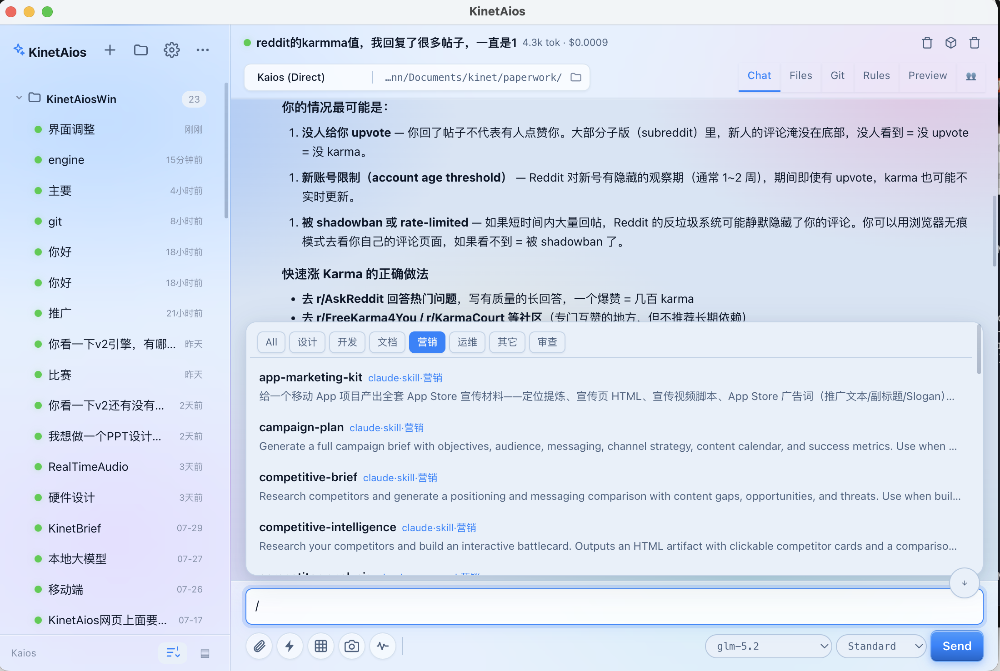

# KinetAios

[English](README.md) | 简体中文

[](LICENSE)
[](https://github.com/phinn/KinetAios)
[](https://github.com/phinn/KinetAios/releases/latest)

> 🌐 **[官网 / Website → https://phinn.github.io/KinetAios/](https://phinn.github.io/KinetAios/)**




本地 AI agent 仪表盘,**跨平台(Windows 11 + macOS)**。并发跑多个会话、流式答案、shell/文件/搜索/MCP 工具、SQLite 历史 + 长期记忆、全局热键、每会话独立模型。**无需账号,无需中继服务器 —— 你的 LLM API key 就是唯一凭证。**

---

## 为什么选 KinetAios?

大多数 AI 客户端把你锁定在一个 provider 上,切引擎就丢上下文,对话还要走中继服务器。KinetAios **一个窗口跑三个引擎**,跨引擎长期记忆,**无需账号**。

|  | KinetAios | Claude Desktop | Cherry Studio | Cursor | Codex Desktop |
|---|---|---|---|---|---|
| 三引擎切换(Direct / Claude Code / Codex) | ✅ | — | — | — | — |
| 本地 SQLite + 自动长期记忆 | ✅ | — | — | — | — |
| 跨引擎记忆(一个用户画像,所有引擎共享) | ✅ | — | — | — | — |
| 多并行会话 | ✅ | — | ✅ | — | ✅ |
| 全局热键 + 快速面板 | ✅ | — | — | — | — |
| 自动扫描 MCP / Skills / Agents | ✅ | ✅ | — | — | — |
| 项目规则(AGENTS / CLAUDE / KINET) | ✅ | — | — | ✅ | ✅ |
| 内置 MCP Server(远程 agent 控制) | ✅ | — | — | — | — |
| 插件系统(工具 / 面板 / slash 命令) | ✅ | — | — | — | — |
| 多模态(图片输入 + 语音 + 截图) | ✅ | ✅ | — | — | — |
| 会话分支 + 跨引擎 Pipeline 编排 | ✅ | — | — | — | — |
| 本地优先,无需账号 | ✅ | ✅ | ✅ | — | — |

## 安装

下载最新发布:

- **Windows** — [`KinetAios-Setup-1.0.0.exe`](https://github.com/phinn/KinetAios/releases/latest) (NSIS 安装包)
- **macOS** — 见 [releases](https://github.com/phinn/KinetAios/releases/latest)

> 未签名构建 → Windows SmartScreen / macOS Gatekeeper 会警告,手动放行。

**首次启动**:点右上角 ⚙ → 填 **API Key**(+ Base URL / 模型,默认 GLM 智谱)→ 「测试连接」通了再发任务。

### 从源码跑

需要 **Node.js 18+** 和联网(native 模块 `better-sqlite3` 要编译)。

```sh
cd KinetAiosWin
npm install      # 含 postinstall:为 Electron 重编 better-sqlite3
npm run build
npm start
```

> 国内网络 `npm install` 拉 Electron 二进制可能超时 —— `.npmrc` 已配 npmmirror 镜像,失败时也可手动 `ELECTRON_MIRROR=https://npmmirror.com/mirrors/electron/ node node_modules/electron/install.js`。

---

## 功能

### 三个引擎(每会话可切,切换清跨引擎上下文)
- **Direct(Kaios)**:内置 ReAct 循环 + GLM/OpenAI 兼容 & Anthropic **双向 SSE 流式** Provider,带工具级并发、子 agent、上下文压缩与重试。
- **Claude Code**:spawn `claude -p --output-format stream-json`,解析 NDJSON,`--resume` 续接。
- **Codex**:spawn `codex exec --json`,解析 JSONL,`resume` 续接。

### Direct 工具(12 个)
`shell`(执行前确认)、`read_file`、`write_file`、`edit_file`(精确替换)、`grep`(递归搜内容)、`glob`(列文件)、`web_fetch`(SSRF 防护 + Jina Reader 回退)、`web_search`(Bing → DuckDuckGo 回退)、`recall_memory`、`git_diff`(只读、免确认)、`dispatch_agent`(只读子 agent —— 独立上下文)、`flight_plan`(插件可注入更多工具)。

### MCP 集成(客户端 + 服务端)
- **客户端**:Direct 引擎自动接入系统配置的 MCP 服务(扫描 `~/.claude.json` / `~/.codex/config.toml` / Claude Desktop),stdio 客户端,意外断开自动重连。🔌 按钮可查看已连服务/工具。
- **服务端**:内置 MCP Server(HTTP+SSE)暴露 `run_agent` 工具 —— 远程机器可以调用本机完整 Agent。Token 鉴权(恒定时间比较)、5 分钟超时、僵尸连接检测。

### 长期记忆 + 记忆图谱
- 每轮后台抽取「关于用户的持久事实」→ SQLite → 注入下轮。**跨引擎、跨会话**共享。
- **记忆图谱**可视化:力导向图展示记忆溯源、冲突检测、时间线。独立全屏窗口。
- 记忆导入/导出 JSON(备份或迁移)。

### Skills / Commands / Agents / 插件
- 扫描 Claude Code 的 skills + commands + agents 和 Codex 的 skills。`/` 菜单或 ⚡ 按钮调用。
- **插件系统 v2.2**:插件可贡献工具、slash 命令、hooks 和全屏面板。按需注入(keywords 关键词匹配省 ~60% token)。内置插件:office-suite、brainstorm(Excalidraw)、math-practice、cpp-learning、low-altitude 等。

### 侧边栏按钮(从左到右)
- **＋** 新建会话。
- **📂 工作台(Workbench)** —— 按 cwd 分组的项目卡片,每张显示近期活动 + 成本。「背景」按钮编辑 `KINET-CONTEXT.md`。
- **📊 仪表盘(Dashboard)** —— 独立窗口,实时 token 用量、成本统计、引擎分布。
- **🌐 文件(Files)** —— 文件浏览 + `<webview>` 预览(HTML/SVG/PNG/JPG/PDF)+ 编辑器。多标签页。地址栏支持 `file://` / `http(s)://` / `localhost:<port>`。
- **🏘️ Town** —— 游戏风格等距可视化,展示网络中的远程节点(其他 KinetAios 实例)。
- **🧠 长期记忆(Memory)** —— 记忆面板:当前频道 / 全部,行内编辑/删除,溯源显示。
- **🔌 插件** —— 插件管理:启用/禁用、搜索过滤、分类卡片。
- **⚙️ 设置** —— 见下。

### 主窗口 Tab(对话 / 文件 / Git / 规则)
- **对话** —— 聊天界面,流式输出、工具步骤折叠、实时 token 计数、上下文检查器、截图、语音输入。
- **文件** —— 与 🌐 同一套,跟随当前会话 cwd。
- **Git** —— `git status`(左)+ `git log`(右)。点改动文件 → 左右对比 diff;点提交 → 统一格式 `git show`。
- **规则** —— 编辑 cwd 的 `KinetAios.md`(项目级规则,注入 system prompt)。

### Pipeline(跨引擎编排)
串联多个 stage,每个指定引擎 + prompt。上一 stage 的输出自动拼到下一 stage 的 prompt 前面。2 分钟/stage 超时轮询,失败中止。

### 会话分支与交接
- **分支(Branch)**:从任意 turn 分叉 —— 深拷贝 turns/steps 生成新会话。
- **导出/导入会话**:序列化完整会话状态(turns + history + engine + model + cwd),支持跨机交接。导出时自动脱敏(API key、密码替换为 `[REDACTED]`)。
- **跨会话引用**:关联相关会话,以 DAG 任务图可视化。

### 上下文管理(Direct 引擎)
- **上下文检查器**:查看/编辑每个会话的 `directHistory` 数组(JSON textarea 编辑器)。
- **自动压缩**:历史超 token 预算时,早期 turns 由 LLM 摘要压缩。压缩事件在 UI 可视化(压缩前后 token 对比)。
- **按协议分别校准**:token/char 比按 API 协议(OpenAI vs Anthropic)分别追踪,避免并发会话互相干扰。

### 多模态(Direct 引擎)
- **图片输入**:📎 选/粘贴图片 → vision content parts → OpenAI `image_url` 或 Anthropic base64 格式。
- **语音**:🎤 录音 → Whisper 转写 → 填入输入框。TTS 走 `speechSynthesis`(自动语言检测,2000 字截断)。
- **截图**:📸 overlay → 拖拽选区 → 裁剪图片注入 prompt。

### 全局搜索
`Ctrl/Cmd+K` 浮层搜索所有会话 —— 匹配 prompt 文本、回答文本和工具输出。

### 设置(⚙️)
- **接口**:provider(OpenAI / Anthropic)、base URL、模型、key。GLM / DeepSeek / OpenAI / Anthropic 预设。智谱余额查询按钮。safeStorage 加密存储。
- **行为**:shell 审批模式、sandbox 级别、计划模式、CLI 引擎开关、关窗行为(退出 / 最小化 / 托盘)。
- **价格**:每个模型的输入/输出价格,用于成本计算。
- **界面**:语言(English / 简体中文 / 繁體中文 / 日本語)、主题(dark / light,实时预览)。
- **长期记忆**:导出/导入 JSON。

### 其它
- **每会话独立模型**(可编辑下拉,OpenAI 兼容 + Anthropic 双协议)。
- **文件附件**:📎 选/拖多个文本文件(大文件只读开头),`@路径` 引用 cwd 内文件。
- **`KinetAios.md` / `AGENTS.md` / `CLAUDE.md`**:cwd 下的规则文件自动注入 system prompt。
- **托盘 + 全局热键** `Ctrl/Cmd+Alt+Space` → 快速面板。
- **可配置品牌**(`brand.json`)、**API key 加密存储**(safeStorage:mac Keychain / Win DPAPI)。

---

## 技术栈

- **Electron + TypeScript** —— 主进程跑 agent 运行时,渲染进程是原生 web UI。
- **better-sqlite3** —— SQLite + FTS5(历史 / `recall_memory` 全文搜索 + embedding 语义召回)。
- **无前端框架** —— 渲染层纯 vanilla TS + HTML/CSS,esbuild 打包。

## 目录结构

```
KinetAiosWin/
  brand.json               # 产品名等品牌配置(启动读)
  package.json
  src/
    shared/types.ts         # 类型 + applyEvent(主/渲染共用,单一事实源)
    shared/i18n.ts          # 四语言字符串表 + t()
    main/
      main.ts               # 窗口 / 托盘 / 热键 / IPC / shell 确认桥
      TaskManager.ts        # 会话管理 + 引擎分派 + 记忆抽取
      engines.ts            # Engine 接口 + Direct/ClaudeCode/Codex + 跨平台 CLI spawn
      AgentLoop.ts          # ReAct 循环(Direct)+ 历史压缩 + 超长自缩
      glm.ts                # Provider + OpenAI/Anthropic SSE 流式 + 重试
      tools.ts              # 12 个工具 + 跨平台 shell + dispatch_agent + git_diff
      mcp.ts                # MCP 客户端(扫描 + stdio + 重连)
      mcp-server.ts         # MCP 服务端(HTTP+SSE, run_agent, token 鉴权)
      skills.ts             # skills/commands/agents/plugin 扫描
      plugins.ts            # 插件加载器(v2.2: 工具/slash命令/hooks/面板)
      store.ts              # better-sqlite3 + FTS5
      settings.ts           # 配置(API key 加密落盘, lang, embedding)
    preload/preload.ts      # contextBridge 暴露的窄 API
    renderer/
      index.html quick.html styles.css
      app.ts                # 仪表盘逻辑(聊天, 侧边栏, 标签页, 上下文检查器)
      quick.ts              # 快速面板逻辑
      dashboard.ts          # 成本/token 仪表盘窗口
      arena.ts              # 深度分析仪表盘
      memory-graph.ts       # 记忆图谱 SVG 可视化
      town.ts               # Town 视图(远程节点可视化)
      files-pane.ts         # 文件浏览 + webview 预览 + 编辑器
      markdown.ts           # 迷你 markdown 渲染
```

## 构建 / 开发

```sh
npm run build       # tsc 编译主进程 + esbuild 打包渲染进程 + 拷 brand.json
npm run typecheck   # 两边 typecheck(不产出)
npm start           # 启动(需先 build)
npm run dev         # build + start
```

## 打包

```sh
npm run dist         # 当前平台默认目标
```

- **Windows**:`release\KinetAios Setup <ver>.exe`(NSIS)。**必须在 Windows 上打**(mac 跨平台打 Windows + native 模块不可靠)。
- **macOS**:打 dmg。`npx electron-builder --mac`(需 mac 工具链)。
- electron-builder 会按 Electron 的 ABI 自动重编 `better-sqlite3`;`asar: false` 避免 native 模块在 asar 里加载报错。
- **未代码签名** → Windows SmartScreen / macOS Gatekeeper 会警告,手动放行。要消警告需签名证书 + Apple 公证。
- 图标默认是 Electron 的;换自己的:Windows 放 `build/icon.ico`(256×256),mac 放 `build/icon.icns`。

## 已知约束

- **关窗行为可配置**(退出 / 最小化 / 托盘),默认最小化。全局热键只在 app 运行时生效。
- mac→Windows 跨平台编译 native 模块不可靠 —— Windows 安装包请在 Windows 机器或 GitHub Actions `windows-latest` runner 上打。
