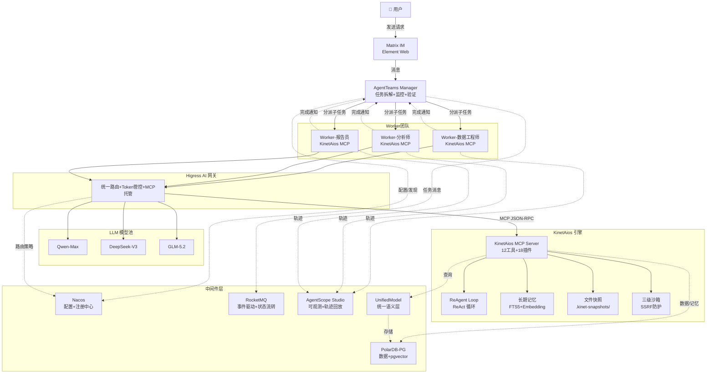
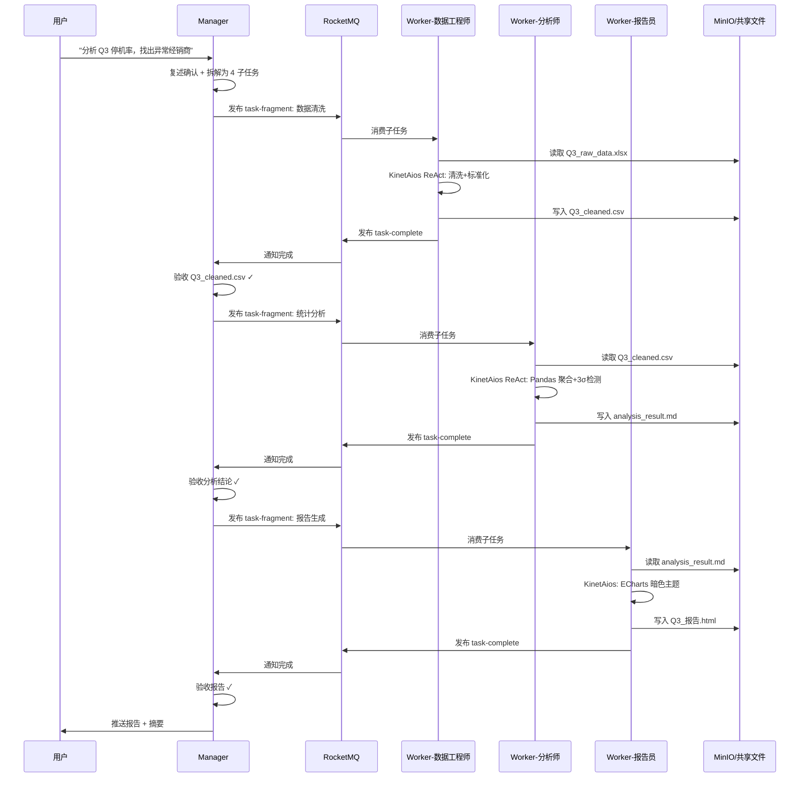
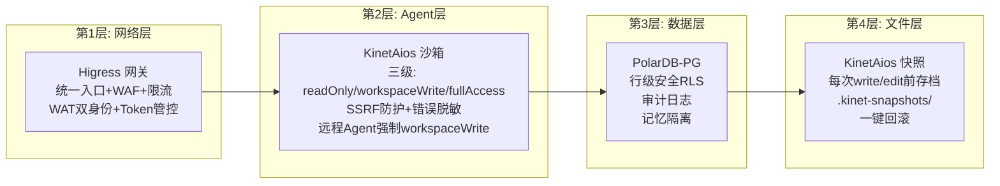
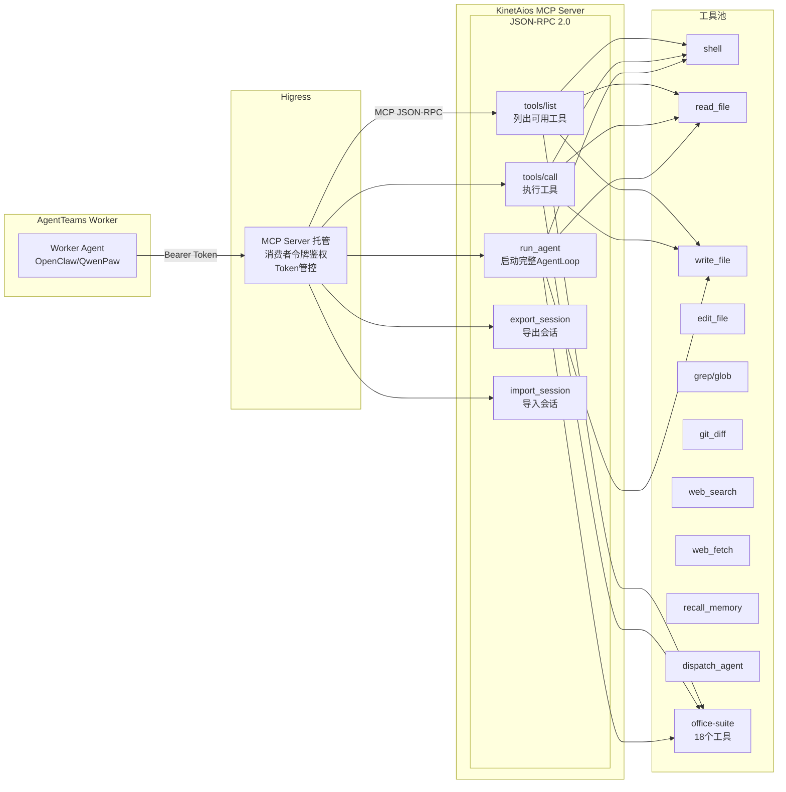
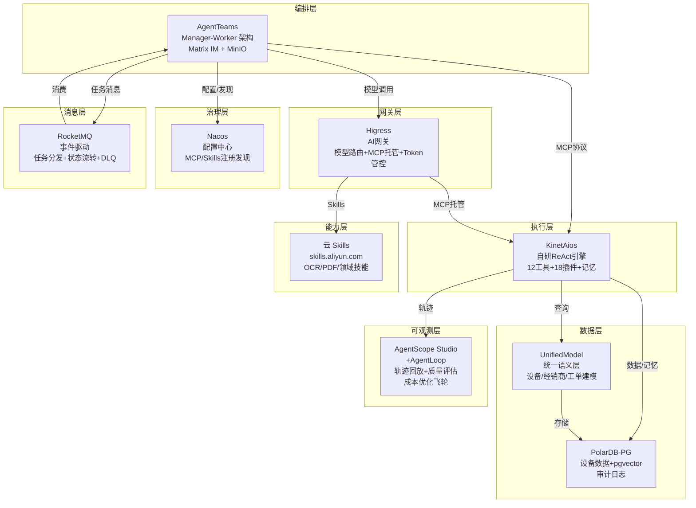

# 架构图（Mermaid）

## 1. 整体架构

```mermaid
graph TB
    User[👤 用户]
    IM[Matrix IM<br/>Element Web]
    Manager[AgentTeams Manager<br/>任务拆解+监控+验证]
    
    User -->|发送请求| IM
    IM -->|消息| Manager
    
    subgraph Worker团队
        W1[Worker-数据工程师<br/>KinetAios MCP]
        W2[Worker-分析师<br/>KinetAios MCP]
        W3[Worker-报告员<br/>KinetAios MCP]
    end
    
    Manager -->|分派子任务| W1
    Manager -->|分派子任务| W2
    Manager -->|分派子任务| W3
    W1 -.->|完成通知| Manager
    W2 -.->|完成通知| Manager
    W3 -.->|完成通知| Manager
    
    subgraph Higress AI 网关
        GW[统一路由+Token管控+MCP托管]
    end
    
    W1 --> GW
    W2 --> GW
    W3 --> GW
    
    subgraph LLM 模型池
        Qwen[Qwen-Max]
        DS[DeepSeek-V3]
        GLM[GLM-5.2]
    end
    
    GW --> Qwen
    GW --> DS
    GW --> GLM
    
    subgraph KinetAios 引擎
        MCP[KinetAios MCP Server<br/>12工具+18插件]
        ReAct[ReAgent Loop<br/>ReAct 循环]
        Memory[长期记忆<br/>FTS5+Embedding]
        Snapshot[文件快照<br/>.kinet-snapshots/]
        Sandbox[三级沙箱<br/>SSRF防护]
    end
    
    GW -->|MCP JSON-RPC| MCP
    MCP --> ReAct
    MCP --> Memory
    MCP --> Snapshot
    MCP --> Sandbox
    
    subgraph 中间件层
        Nacos[Nacos<br/>配置+注册中心]
        PolarDB[PolarDB-PG<br/>数据+pgvector]
        RocketMQ[RocketMQ<br/>事件驱动+状态流转]
        AgentLoop[AgentScope Studio<br/>可观测+轨迹回放]
        UModel[UnifiedModel<br/>统一语义层]
    end
    
    Manager -.->|配置/发现| Nacos
    GW -.->|路由策略| Nacos
    MCP -.->|数据/记忆| PolarDB
    Manager -.->|任务消息| RocketMQ
    W1 -.->|轨迹| AgentLoop
    W2 -.->|轨迹| AgentLoop
    W3 -.->|轨迹| AgentLoop
    MCP -.->|查询| UModel
    UModel -.->|存储| PolarDB
```

## 2. 任务协同流程

```mermaid
sequenceDiagram
    participant U as 用户
    participant M as Manager
    participant MQ as RocketMQ
    participant W1 as Worker-数据工程师
    participant W2 as Worker-分析师
    participant W3 as Worker-报告员
    participant FS as MinIO/共享文件
    
    U->>M: "分析 Q3 停机率，找出异常经销商"
    M->>M: 复述确认 + 拆解为 4 子任务
    
    M->>MQ: 发布 task-fragment: 数据清洗
    MQ->>W1: 消费子任务
    W1->>FS: 读取 Q3_raw_data.xlsx
    W1->>W1: KinetAios ReAct: 清洗+标准化
    W1->>FS: 写入 Q3_cleaned.csv
    W1->>MQ: 发布 task-complete
    MQ->>M: 通知完成
    
    M->>M: 验收 Q3_cleaned.csv ✓
    
    M->>MQ: 发布 task-fragment: 统计分析
    MQ->>W2: 消费子任务
    W2->>FS: 读取 Q3_cleaned.csv
    W2->>W2: KinetAios ReAct: Pandas 聚合+3σ检测
    W2->>FS: 写入 analysis_result.md
    W2->>MQ: 发布 task-complete
    MQ->>M: 通知完成
    
    M->>M: 验收分析结论 ✓
    
    M->>MQ: 发布 task-fragment: 报告生成
    MQ->>W3: 消费子任务
    W3->>FS: 读取 analysis_result.md
    W3->>W3: KinetAios: ECharts 暗色主题
    W3->>FS: 写入 Q3_报告.html
    W3->>MQ: 发布 task-complete
    MQ->>M: 通知完成
    
    M->>M: 验收报告 ✓
    M->>U: 推送报告 + 摘要
```

## 3. 安全架构

```mermaid
graph LR
    subgraph 第1层: 网络层
        H[Higress 网关<br/>统一入口+WAF+限流<br/>WAT双身份+Token管控]
    end
    
    subgraph 第2层: Agent层
        K[KinetAios 沙箱<br/>三级: readOnly/workspaceWrite/fullAccess<br/>SSRF防护+错误脱敏<br/>远程Agent强制workspaceWrite]
    end
    
    subgraph 第3层: 数据层
        P[PolarDB-PG<br/>行级安全RLS<br/>审计日志<br/>记忆隔离]
    end
    
    subgraph 第4层: 文件层
        S[KinetAios 快照<br/>每次write/edit前存档<br/>.kinet-snapshots/<br/>一键回滚]
    end
    
    H --> K --> P --> S
```

## 4. MCP 协议对接

```mermaid
graph LR
    subgraph AgentTeams Worker
        A[Worker Agent<br/>OpenClaw/QwenPaw]
    end
    
    subgraph Higress
        HG[MCP Server 托管<br/>消费者令牌鉴权<br/>Token管控]
    end
    
    subgraph KinetAios MCP Server
        subgraph JSON-RPC 2.0
            TL[tools/list<br/>列出可用工具]
            TC[tools/call<br/>执行工具]
            RA[run_agent<br/>启动完整AgentLoop]
            ES[export_session<br/>导出会话]
            IS[import_session<br/>导入会话]
        end
    end
    
    subgraph 工具池
        T1[shell]
        T2[read_file]
        T3[write_file]
        T4[edit_file]
        T5[grep/glob]
        T6[git_diff]
        T7[web_search]
        T8[web_fetch]
        T9[recall_memory]
        T10[dispatch_agent]
        T11[office-suite<br/>18个工具]
    end
    
    A -->|Bearer Token| HG
    HG -->|MCP JSON-RPC| TL
    HG --> TC
    HG --> RA
    HG --> ES
    HG --> IS
    
    TL --> T1
    TC --> T1
    RA --> T1
    TL --> T2
    TC --> T2
    RA --> T2
    TL --> T3
    TC --> T3
    RA --> T3
    TL --> T11
    TC --> T11
    RA --> T11
```

## 5. 技术栈全景

```mermaid
graph TB
    subgraph 编排层
        AT[AgentTeams<br/>Manager-Worker 架构<br/>Matrix IM + MinIO]
    end
    
    subgraph 执行层
        KA[KinetAios<br/>自研ReAct引擎<br/>12工具+18插件+记忆]
    end
    
    subgraph 网关层
        HI[Higress<br/>AI网关<br/>模型路由+MCP托管+Token管控]
    end
    
    subgraph 治理层
        NA[Nacos<br/>配置中心<br/>MCP/Skills注册发现]
    end
    
    subgraph 数据层
        PP[PolarDB-PG<br/>设备数据+pgvector<br/>审计日志]
        UM[UnifiedModel<br/>统一语义层<br/>设备/经销商/工单建模]
    end
    
    subgraph 消息层
        RM[RocketMQ<br/>事件驱动<br/>任务分发+状态流转+DLQ]
    end
    
    subgraph 可观测层
        AS[AgentScope Studio<br/>+AgentLoop<br/>轨迹回放+质量评估<br/>成本优化飞轮]
    end
    
    subgraph 能力层
        SK[云 Skills<br/>skills.aliyun.com<br/>OCR/PDF/领域技能]
    end
    
    AT -->|MCP协议| KA
    AT -->|任务消息| RM
    AT -->|配置/发现| NA
    AT -->|模型调用| HI
    HI -->|MCP托管| KA
    KA -->|数据/记忆| PP
    KA -->|查询| UM
    UM -->|存储| PP
    HI -->|Skills| SK
    KA -->|轨迹| AS
    RM -->|消费| AT
```
